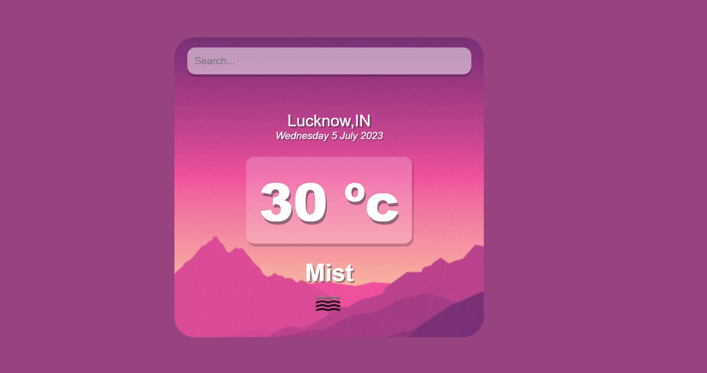
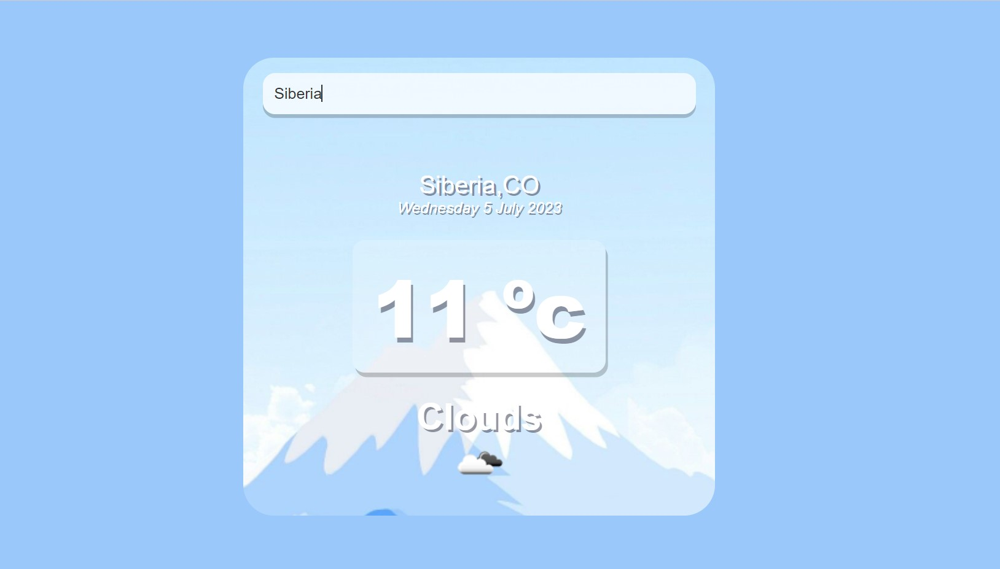

# __React Weather App__

This is a weather application built using React.js that provides users with real-time weather information for different locations. With React Weather App, you can stay updated on current weather conditions, temperature, humidity, wind speed, and more.

Deployed Link : https://rahulmaurya-exe.github.io/react-weather-app/

---
## __Screenshots__




---
## __Features__

- **Real-Time Weather Data:** The app fetches weather data from a OpenWeatherMap API to provide users with up-to-date information about the current weather conditions in their selected location.

- **Search Functionality:** Users can search for weather information for specific locations by entering the city name or ZIP code. The app retrieves the relevant weather data and displays it on the screen.

- **Different Themes:** App has different theme for hot and cold conditions.

---
## __Installation__

To run the React Weather App locally, follow these steps:

1. Clone the repository:

   ```
   git clone https://github.com/rahulmaurya-exe/react-weather-app.git
   ```

2. Navigate to the project directory:

   ```
   cd react-weather-app
   ```

3. Install the dependencies:

   ```
   npm install
   ```

4. Start the development server:

   ```
   npm start
   ```

5. Open your web browser and visit `http://localhost:3000` to access the React Weather App.

---
## __Tech Stack__

The React Weather App is built using the following technologies:

- React.js: A JavaScript library for building user interfaces.
- HTML: The markup language used for structuring the app.
- CSS: The styling language used for enhancing the app's visual appearance.
- OpenWeatherMap API : API to fetch the realtime weather condition.

---
## __Folder Structure__

The folder structure of the React Weather App is organized as follows:

```
react-weather-app/
  ├── public/
  │   ├── index.html
  │   └── ...
  ├── src/
  │   ├── assests/
  │   │   ├── cold-bg.jpg
  │   │   ├── warm-bg.js
  │   ├── App.js
  │   ├── index.js
  │   └── index.css
  ├── package.json
  ├── package-lock.json
  ├── README.md

```

- **public**: Contains the index.html file, which is the entry point for the application.

- **src**: Contains the source code of the React Weather App.

  - **assessts**: Contains image assets used in the app, such as weather icons.

  - **App.js**: The main component that serves as the entry point for the application.

  - **index.js**: The file responsible for rendering the App component and mounting it into the HTML document.

- **package.json**: Contains information about the project and its dependencies.

- **package-lock.json**: Automatically generated file that provides version information for the installed dependencies.

- **README.md** : The readme file that provides information about the React Weather App.

---
## __Usage__

Once the React Weather App is running, you can perform the following actions:

- **Search for Weather:** Enter the name of a city or ZIP code in the search bar to fetch the weather information for that location. The app will display the current weather conditions, temperature, humidity, wind speed, and other relevant details.

---
## __License__

This project is licensed under the [MIT License](LICENSE).

---